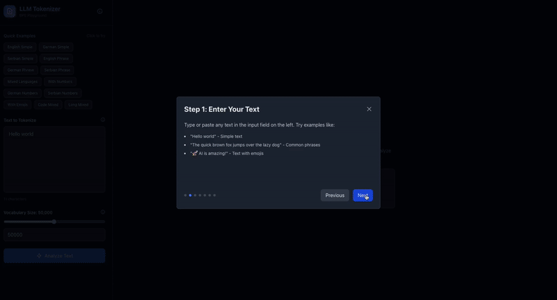

# LLM Tokenizer Playground 🚀



An interactive, educational web application that visualizes how Large Language Models (LLMs) like ChatGPT tokenize text using Byte Pair Encoding (BPE). Built with Rust and React, this playground helps you understand the fundamental process behind text tokenization.


## ✨ Features

- **Interactive BPE Visualization**: Step through the tokenization process and watch how characters merge into tokens
- **Real-time Token Display**: See tokens with unique color-coded visualizations
- **Vocabulary Explorer**: Browse the complete vocabulary table as it's built step-by-step
- **Byte View Toggle**: Switch between text and byte representations
- **Statistics Dashboard**: View compression ratios, token counts, and average token sizes
- **Quick Examples**: Try pre-configured examples to see different tokenization patterns
- **Educational Tutorial**: Built-in onboarding to help you get started

## 🎯 What is Tokenization?

Tokenization is the process of breaking down text into smaller units called "tokens" that language models can process. This playground demonstrates **Byte Pair Encoding (BPE)**, the algorithm used by GPT models:

1. **Start with characters**: Initially, each character is a separate token
2. **Find frequent pairs**: The algorithm identifies the most common adjacent token pairs
3. **Merge pairs**: These pairs are merged into new tokens
4. **Repeat**: This process continues until the desired vocabulary size is reached

## 🏗️ Architecture

This is a monorepo with two main components:

### Backend (`/server`) - Rust
- **Framework**: Axum web server
- **Algorithm**: Naive BPE implementation from scratch (no external tokenizer libraries)
- **Features**:
  - RESTful API endpoint for text analysis
  - Step-by-step merge history tracking
  - Vocabulary building with configurable size

### Frontend (`/client`) - React + TypeScript
- **Build Tool**: Vite
- **Styling**: Tailwind CSS
- **Animations**: Framer Motion
- **Features**:
  - Interactive token visualization
  - Step-by-step merge replay
  - Vocabulary table with highlighting
  - Statistics dashboard
  - Tutorial/onboarding system

## 🚀 Getting Started

### Prerequisites

- **Rust** (1.70 or later): [Install Rust](https://www.rust-lang.org/tools/install)
- **Node.js** (18 or later): [Install Node.js](https://nodejs.org/)
- **npm** or **yarn**

### Installation

1. **Clone the repository**
   ```bash
   git clone https: https://github.com/MilanKacar/learn-2-tokenize.git
   cd learn-2-tokenize
   ```

2. **Start the Backend Server**
   ```bash
   cd server
   cargo run
   ```
   The server will start on `http://127.0.0.1:3000`

3. **Start the Frontend Client** (in a new terminal)
   ```bash
   cd client
   npm install
   npm run dev
   ```
   The client will start on `http://localhost:5173`

4. **Open your browser**
   Navigate to `http://localhost:5173` and start exploring!

## 📖 How to Use

1. **Enter Text**: Type or paste any text in the input field, or use the quick examples
2. **Set Vocabulary Size**: Adjust the vocabulary size slider (default: 50,000)
3. **Analyze**: Click "Analyze Text" to start tokenization
4. **Explore**: 
   - Use Previous/Next buttons to step through merge operations
   - Use the slider to jump to any step
   - Hover over tokens to see details (ID, value, byte length)
   - Toggle "Show Bytes" to see raw byte representations
   - Check the vocabulary table to see all tokens

## 🎓 Learning Resources

### Understanding BPE

- **Initial State**: Text is split into individual characters
- **Merge Process**: Most frequent adjacent pairs are merged first
- **Iteration**: Process repeats until vocabulary size is reached
- **Result**: Common patterns (like "th", "he", "ing") become single tokens

### Key Concepts

- **Token ID**: Unique identifier for each token in the vocabulary
- **Byte Length**: Number of bytes the token occupies
- **Compression Ratio**: How much the token count reduced from initial characters
- **Vocabulary**: Complete set of all tokens the model "knows"

## 🛠️ Development

### Project Structure

```
tokenizer/
├── server/                 # Rust backend
│   ├── src/
│   │   ├── main.rs         # Axum server setup
│   │   └── bpe.rs          # BPE algorithm implementation
│   └── Cargo.toml
├── client/                 # React frontend
│   ├── src/
│   │   ├── components/     # React components
│   │   ├── utils/         # Utility functions
│   │   └── App.tsx         # Main app component
│   └── package.json
└── README.md
```

### Building for Production

**Backend:**
```bash
cd server
cargo build --release
```

**Frontend:**
```bash
cd client
npm run build
```

## 🤝 Contributing

Contributions are welcome! Please feel free to submit a Pull Request. Here are some areas where contributions would be helpful:

- Performance optimizations for large vocabularies
- Additional visualization features
- More example texts and use cases
- Documentation improvements
- Bug fixes and testing

## 📝 License

This project is open source and available under the [MIT License](LICENSE).

## 🙏 Acknowledgments

- Inspired by the need to understand how LLMs process text
- Built to help developers and students learn about tokenization
- Uses educational BPE implementation to demonstrate the algorithm clearly

## 🔗 Related Resources

- [OpenAI's GPT Tokenizer](https://platform.openai.com/tokenizer)
- [Hugging Face Tokenizers](https://huggingface.co/docs/tokenizers/)
- [Byte Pair Encoding Paper](https://arxiv.org/abs/1508.07909)

## 📧 Contact

For questions, suggestions, or issues, please open an issue on GitHub.

---

**Made with ❤️ to help people understand how LLMs work**


plase change this this is my source directory:
ssh: git@github.com:MilanKacar/learn-2-tokenize.git
https: https://github.com/MilanKacar/learn-2-tokenize.git
